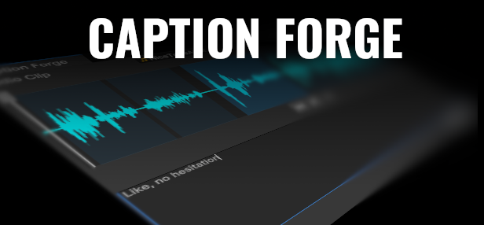
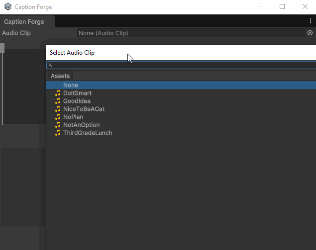

# Caption Forge

Caption Forge, in its current form, provides a Unity Editor Tool for assisting you in creating SRT files for targeted AudioClip files.

## Installation

To install the SDK, you can either import a custom package that I'll try to provide every version release, or install the SDK via your Unity Package Manager.

```bash
https://github.com/cole-gamedev/CaptionForge-UnitySDK.git?path=/PackageReleases
```

## Usage
Launch the tool while in Editor via `Tools/CaptionForge`

Assign a target AudioClip you want to generate an SRT file for.

Draw subtitle boxes over sections of your audio clip sample, press `DEL` if any have been made accidentally or if you wish to re-do one.  The ability to move and scales subtitle boxes will come in later updates.

Click on your drawn subtitle boxes to select them, then type in their text below.

Media player buttons are available to listen to the audioclip, as well has a start sample position bar you can shift around to make your setup process more efficient.

Finally, click "Export SRT" when finished to select a location to save your SRT file.



## Contributing

Pull requests are welcome. For major changes, please open an issue first
to discuss what you would like to change.

Please make sure to update tests as appropriate.

## License

[MIT](https://choosealicense.com/licenses/mit/)